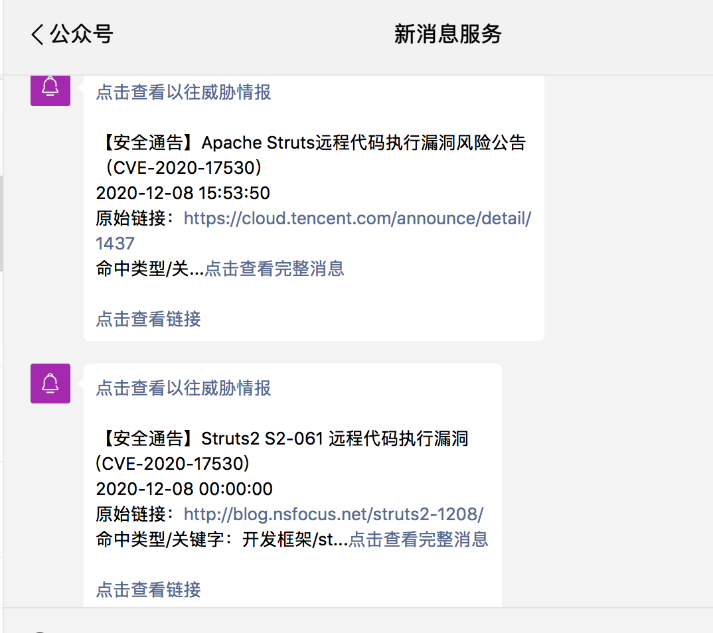
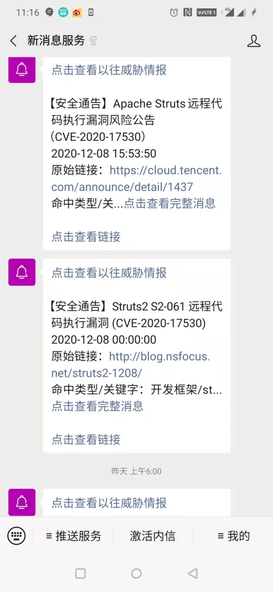
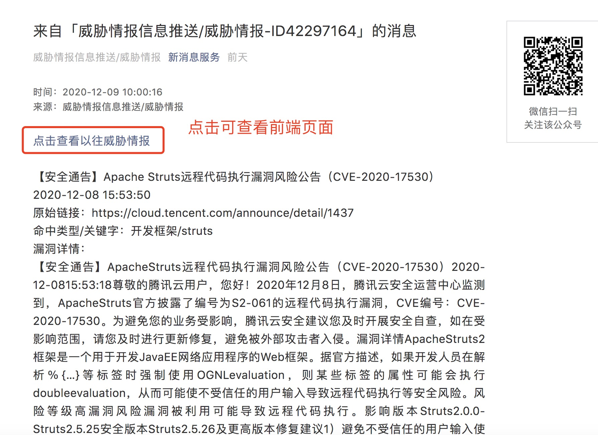
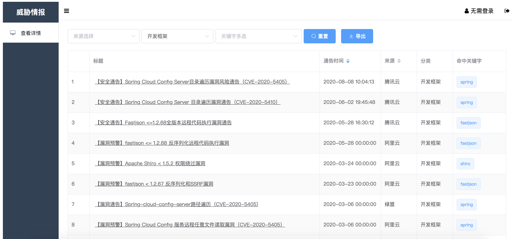

# threaten_flask_vue
爬取外部威胁漏洞情报数据做展示并做微信推送，可自己加爬威胁漏洞情报源，前后端分离，前端vue，后台使用py3-flask
# flask威胁情报
-   重构原本的原生前端为vue，可以简单实现翻页功能，并实现前后端分离
-   前端使用vue框架
-   后台使用python3的flask框架
-   目前威胁情报源只有CNNVD，腾云云，阿里云，绿盟，可自行添加爬取的漏洞情报源，处理主流程不变
## 简介
- /manager.py 运行文件，主逻辑未剥离，判断是否增量爬取，推送
- /type_difinite.py 对爬取的内容进行分类处理
- /disclosure 数据泄漏爬取，还未引用
- /fullAmount_oneexecute 全量爬取威胁情报并写入excel
- /increment 增量爬取类
- /templates 前端模版

##运行
-   1/按照manage的26行建立mysql数据库，并在21行重设数据库密码
-   2/需要先执行fullAount_oneexecute全量跑一波数据再导入excel，也可忽略此步，忽略即没有存量漏洞数据；或者在other中的xlsx直接导入mysql数据库中做存量数据
-   3/cnnvd的数据质量差，代码中已注释，是否需要可自行解除注释
-   4/使用微信推送需要自己先[登录](https://wxpusher.zjiecode.com/docs/#/)注册，manage的197和213行填入自己申请到的appToken和主题模板
-   5/下载依赖pip3 -r install requirements.txt，之后直接运行manage.py即可运行整个程序

##效果图

